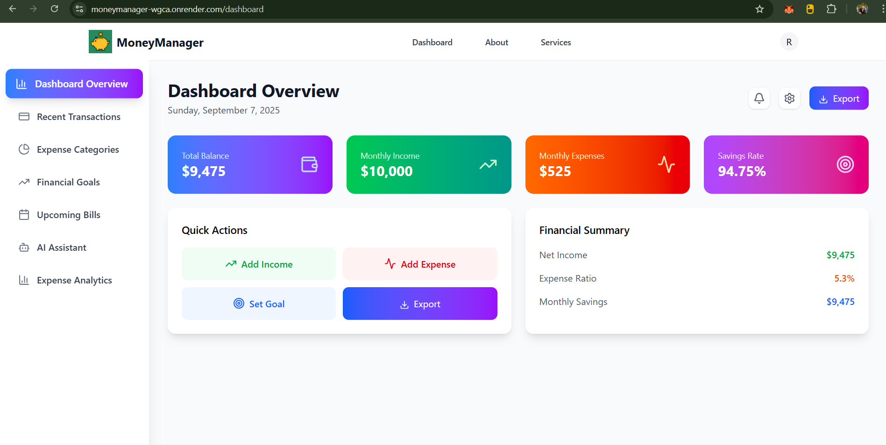

# 💰 MoneyManager

MoneyManager is a modern full-stack web application that revolutionizes personal finance management through intelligent automation and AI integration. Built with React.js, Node.js, and MongoDB, it offers comprehensive expense tracking, goal management, automated bill reminders with Razorpay payments, and an AI financial assistant that provides personalized insights. The platform features advanced analytics with multiple chart visualizations, professional report generation, and secure JWT authentication with Google OAuth, making it a complete solution for individuals seeking to optimize their financial health and achieve their monetary goals.

[](https://moneymanager-wgca.onrender.com/)
[](https://github.com/jishnu2021/MoneyManager)

## 📸 Screenshots

### 1. Home


### 2. Dashboard



## 📖 Overview

MoneyManager is a modern financial management platform designed to simplify personal finance tracking. With intuitive dashboards, intelligent analytics, and AI-powered assistance, users can make informed financial decisions and achieve their monetary goals effectively.

## ✨ Key Features

### 🔐 **Authentication & Security**
- Secure JWT-based authentication
- Google OAuth integration for seamless login
- Protected user sessions and data

### 💰 **Income & Expense Tracking**
- Comprehensive transaction management
- Categorized income and expense tracking
- Multiple payment method support
- Source-based organization

### 🎯 **Goal Management**
- Set and track financial goals
- Progressive contribution system
- Visual progress indicators
- Goal achievement notifications

### 📊 **Advanced Analytics**
- Monthly financial analytics dashboard
- Multiple chart types: Radar, Bar, Line, and Density plots
- Spending pattern analysis
- Budget vs actual comparisons

### 🤖 **AI Financial Assistant**
- Intelligent chat-based financial advisor
- Personalized financial insights and recommendations
- Conversation history saved per user
- RAG-style query processing for accurate responses

### 📅 **Bill Management & Reminders**
- Comprehensive bill tracking system
- Automated email reminder notifications
- Integrated Razorpay payment gateway (test mode)
- Payment history and status tracking

### 📑 **Professional Reporting**
- Exportable financial reports
- Comprehensive user profile summaries
- Balance sheets and transaction histories
- Income and expense breakdowns

### 💵 **Financial Health Metrics**
- Budget creation and monitoring
- Automatic savings rate calculation
- Monthly spending analysis
- Financial goal progress tracking

## 🛠️ Tech Stack

### Frontend
- **React.js** - Modern UI framework
- **Vite** - Fast build tool and development server
- **Tailwind CSS** - Utility-first CSS framework
- **Axios** - HTTP client for API requests
- **React Router** - Client-side routing

### Backend
- **Node.js** - JavaScript runtime
- **Express.js** - Web application framework
- **Mongoose** - MongoDB object modeling
- **JWT** - Token-based authentication

### Database & Services
- **MongoDB** - NoSQL database
- **Razorpay** - Payment gateway integration (test mode)
- **Nodemailer + Gmail SMTP** - Email notification service
- **LLM Integration** - AI assistant with RAG architecture

## 🚀 Installation & Setup

### Prerequisites
- Node.js (v14 or higher)
- MongoDB instance
- Gmail account for SMTP
- Razorpay account for payment integration

### Step-by-Step Installation

1. **Clone the repository**
   ```bash
   git clone https://github.com/jishnu2021/MoneyManager.git
   cd MoneyManager
   ```

2. **Install dependencies**
   ```bash
   npm install
   ```

3. **Environment Configuration**
   
   Create a `.env` file in the root directory:
   ```env
   PORT=3000
   MONGO_URI=your_mongodb_connection_string
   JWT_SECRET=your_jwt_secret_key
   RAZORPAY_KEY_ID=your_razorpay_key_id
   RAZORPAY_KEY_SECRET=your_razorpay_secret_key
   EMAIL_USER=your_gmail_address
   EMAIL_PASS=your_gmail_app_password
   VITE_API_URI=http://localhost:3000/api
   ```

4. **Start the backend server**
   ```bash
   nodemon
   ```

5. **Launch the frontend application**
   ```bash
   npm run dev
   ```

6. **Access the application**
   
   Open your browser and navigate to `http://localhost:5173`

## 🔗 API Endpoints

### Transaction Management
```http
POST /api/transaction              # Add new income/expense
GET  /api/transactions/monthly-totals  # Get monthly financial totals
```

### Goal Management
```http
POST /api/goals                    # Create new financial goal
POST /api/goals/:id/contribute     # Contribute to specific goal
```

### Bill Management
```http
POST /api/bill/add                 # Add new bill
GET  /api/bills                    # Retrieve all user bills
POST /api/bill/:id/pay             # Process bill payment via Razorpay
```

### Reporting
```http
GET  /api/reports/export           # Download comprehensive financial report
```

### AI Assistant
```http
POST /api/assistant/ask            # Submit financial query to AI assistant
```

## 📱 Usage Guide

1. **Getting Started**
   - Register a new account or login with existing credentials
   - Complete your profile setup

2. **Financial Tracking**
   - Add your income sources and amounts
   - Record daily expenses with proper categorization
   - Monitor your monthly totals and savings rate

3. **Goal Setting**
   - Create specific financial goals with target amounts
   - Make regular contributions towards your goals
   - Track progress with visual indicators

4. **Bill Management**
   - Add recurring bills with due dates
   - Set up email reminders for upcoming payments
   - Pay bills securely through Razorpay integration

5. **Analytics & Insights**
   - View comprehensive analytics dashboards
   - Export detailed financial reports
   - Chat with the AI assistant for personalized advice

## 🤝 Contributing

We welcome contributions to make MoneyManager even better! Here's how you can help:

1. Fork the repository
2. Create a feature branch (`git checkout -b feature/amazing-feature`)
3. Commit your changes (`git commit -m 'Add amazing feature'`)
4. Push to the branch (`git push origin feature/amazing-feature`)
5. Open a Pull Request

For major changes, please open an issue first to discuss what you would like to change.


## 🔗 Links

- **Live Application:** [MoneyManager on Render](https://moneymanager-wgca.onrender.com/)
- **Source Code:** [GitHub Repository](https://github.com/jishnu2021/MoneyManager)
